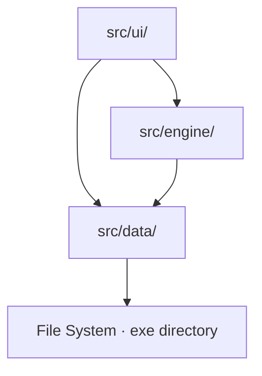

# CommerceHelper — Architecture

## Overview

CommerceHelper is a Windows desktop app that helps a single Mabinogi player plan commerce trade routes. The player configures their character setup once (transports owned, speed bonus, merchant ratings, etc.), then uses either Threshold Mode — a precomputed table of "if prices are around X, here is your best route" — or Live Mode, where they type in the actual profit figures from the trade window and get a precise ranked list back in seconds.

The architecture is a three-layer, unidirectional stack built in Zig. The choice reflects the app's nature: it is a small, self-contained desktop tool with no network requirement, no concurrent workloads, and a single developer who needs to move fast without fighting tooling. Zig gives a single-binary output, predictable memory control, and a compile-time import graph that enforces the layer boundaries for free. The entire system fits in one process with no background threads, which makes the state model trivially simple at the cost of a brief synchronous pause when a heavy recalculation runs — a tradeoff that is acceptable given how infrequently configuration changes.

---

## Stack

**Zig 0.14.1** is the sole language. Chosen over alternatives (Rust, C++) primarily because the developer knows it, and because Zig's comptime features and explicit allocator model are a natural fit for a small tool with tight control over where memory lives. No async runtime is needed; single-threaded synchronous execution covers all use cases.

**dvui v0.3.0** (pinned tag, targets Zig 0.14.1) is the GUI library. Chosen because it is a pure-Zig immediate-mode UI framework with a DX11 backend, meaning zero native dependencies beyond Windows system DLLs. An alternative like Dear ImGui would require a C bridge; a web-based approach (Tauri, Electron) would add runtime dependencies that conflict with the standalone-executable distribution goal.

**DX11 backend** is dvui's Windows rendering path. It uses Windows system DLLs — no redistributables are needed in the installer. This is the right default for a Windows-10/11-only v1 tool.

**JSON via std.json** handles all persisted data. The standard library parser is sufficient; no external JSON crate is needed.

---

## Layered Structure

The app is divided into three layers. The rule is strict and enforced at compile time by Zig's import system: a layer may only import from layers below it, never above.

```
┌─────────────────────────────┐
│          src/ui/            │  dvui render loop, all panels
├─────────────────────────────┤
│         src/engine/         │  route matrix, optimizer, results
├─────────────────────────────┤
│          src/data/          │  file I/O, structs, JSON parse/write
└─────────────────────────────┘
```



**data** owns all structs and persistence. It knows how to read and write JSON, it defines the shape of Config, Goods, and RouteData, and it has no knowledge of calculation logic or UI widgets. It is the foundation — the only layer that touches the file system.

**engine** owns all calculation. It takes data structs as inputs and produces results (a route matrix, threshold rows, live rankings). It knows nothing about dvui and imports nothing from ui. This is the boundary that prevents the worst kind of coupling: an optimizer that reaches up to query a UI widget's state, or a render loop that bakes in calculation assumptions.

**ui** owns all rendering and user interaction. It reads from engine and data, calls Config setters when the player changes a setting, and renders whatever engine state is current. It is the only layer that imports dvui.

The no-upward-dependency rule matters because violations compound. Once engine imports a ui type to "ask" about something, you have circular-import potential, untestable calculation logic, and a codebase where changing a widget means reasoning about its effect on optimization. Zig will refuse to compile a circular import, so the constraint is self-enforcing.

---

## Source Tree

```text
CommerceHelper/
  build.zig               # Build script. Declares dvui as a dependency, compiles the exe,
                          # and copies assets/ into the output directory at build time.
  build.zig.zon           # dvui v0.3.0 dependency declaration (pinned tag).
  src/
    main.zig              # Entry point. Initializes the GPA, sets up DX11 + dvui, creates
                          # AppState, and runs the render loop. Owns the root allocator.
    data/
      config.zig          # Config struct definition. Reads/writes config.json. All field
                          # writes go through a setter that sets the engine dirty flag and
                          # persists to disk. UI code must never mutate Config fields directly.
      goods.zig           # Loads goods.json into Good and OutpostGoods structs. Embedded
                          # default bytes for @embedFile restore are compiled in here.
      routes.zig          # Loads routes.json into RouteData structs (land times, boat leg
                          # components). Embedded default bytes for @embedFile restore likewise
                          # compiled in here.
    engine/
      matrix.zig          # Builds the 12×12 RouteMatrix of base travel times from RouteData.
                          # Does not bake in speed or transport — those are applied at
                          # optimization time. Invalidated when route data changes.
      optimizer.zig       # Core load optimization: computes primary Good quantity, Mixed Load
                          # fill, and applies speed/transport factors to matrix times. Enforces
                          # the Boat Leg bypass (fixed wait+sail, unaffected by speed bonus).
                          # Handles discount application (Rating Discount + Gear Discount).
      threshold.zig       # Runs the threshold sweep (Good x Threshold x Destination, Epic 4) and
                          # manages the per-origin cache. Each origin's results are lazily
                          # populated on first view, heap-boxed, and stored until invalidated.
                          # ThresholdCell struct lives here.
      live.zig            # Runs live mode ranking from player-entered profit/unit values.
                          # LiveResult and LoadComposition structs live here. Results are held
                          # from the last Calculate press and cleared on Config/Origin change.
    ui/
      app.zig             # AppState struct. Owns the Engine instance. Drives tab dispatch,
                          # renders the origin dropdown, and triggers the settings panel.
                          # Calls Engine.update() at the top of every render frame.
      onboarding.zig      # First-run wizard. Runs before the main UI if config.json is absent.
                          # Collects all Config fields sequentially; cannot be skipped.
      settings.zig        # Settings panel: all Config fields editable, plus the route time
                          # matrix editor. Changes are written via Config setters immediately.
      threshold.zig       # Threshold tab rendering: table of threshold rows with Good icons,
                          # add/remove threshold controls.
      live.zig            # Live tab rendering: profit input grid (Good-by-Destination) and
                          # results table. Renders Good icons and load compositions.
  assets/
    goods.json            # Shipped with the app; copied to output dir by build.zig.
    routes.json           # Shipped with the app; copied to output dir by build.zig.
    static/
      img/
        good/             # Good icon images. Referenced by the image field in goods.json,
                          # resolved relative to the exe directory at runtime.
```

---

## Engine in Depth

The engine is the most important part of the system to understand. It is a stateful struct, instantiated once inside `AppState`, that holds three distinct caches and decides what to recompute on each render frame.

### The Three Cache Levels

**Route matrix** (`engine/matrix.zig`) is the base 12×12 table of travel times between outposts. These are computed from RouteData by applying the routing rules (direct land, Uladh↔Iria two-boat routes, etc.) but without baking in any transport or speed values — those are applied later in `optimizer.zig`. The matrix is invalidated only when route data itself changes: either because the player edited a travel time in Settings, or because routes.json was replaced. It is not invalidated by changing speed bonus, transports, or anything else in Config.

**Per-origin threshold cache** (`engine/threshold.zig`) holds one complete set of threshold results per origin outpost. It is lazily populated: the first time the player views an origin in Threshold Mode, the full sweep runs and the result is stored. Subsequent views of the same origin just read from the cache. This cache is invalidated when speed bonus, transport ownership, modifiers, merchant rating, gear discount, or the route matrix changes — anything that would change what the best route actually is.

**Epic 4 shape (Threshold Mode Overhaul):** `sweepOrigin` no longer keeps "one winning row per Threshold." It now sweeps Good × Threshold × Destination — for each Good eligible at the Origin, for each configured Threshold, for each reachable Destination, the best owned Transport. Threshold Mode evaluates single-Good Loads only; Mixed Loads (secondary Goods filling leftover capacity) are Live Mode's behavior only and are not considered here.

This 3-dimensional shape is much larger than the old "one row per Threshold" cache, so its storage moves off the stack: `AppState` used to hold `[12]?OriginResult` as a plain inline value array, but at a real per-Good bound of 8 (60% headroom over the shipped 5-Goods-per-Outpost data) × 32 Thresholds × 11 reachable Destinations, one origin's worth of cells is already around 112KB — and `AppState` itself is a plain stack-resident local in `main.zig` (`var app_state = ...`), with no explicit stack-size override in `build.zig`, so it inherits Windows' default ~1MB thread-stack reserve. Keeping all 12 origins' worth (~1.35MB worst case) inline would risk overflowing that stack. So the cache is now heap-boxed: `AppState` holds `[12]?*OriginResult`, and the root GPA `create()`s one `OriginResult` per origin on first sweep, `destroy()`ing it before a slot is nulled on invalidation. `sweepOrigin` itself is unchanged in spirit — still a pure, allocator-free function returning its result by value — the boxing/freeing responsibility lives in `updateCache`/`AppState`, not inside `sweepOrigin`. If the GPA allocation for a new per-origin box ever fails, `updateCache` leaves that cache slot `null` rather than crashing or storing partial state; the sweep is simply retried on the next call that needs it.

**Live results** (`engine/live.zig`) hold the output of the most recent Calculate press. They are not automatically recomputed. Any Config change or origin switch clears them. The player must press Calculate again to get fresh results.

### What Invalidates Each

| What changed | Route matrix | Threshold cache | Live results |
|---|---|---|---|
| Route data (routes.json edit or UI edit) | Invalidated | Invalidated | Cleared |
| Speed bonus | No | Invalidated | Cleared |
| Transport ownership | No | Invalidated | Cleared |
| Modifier (Partner/Grandmaster) | No | Invalidated | Cleared |
| Merchant Rating | No | Invalidated | Cleared |
| Gear Discount | No | Invalidated | Cleared |
| Origin switch | No | Not invalidated | Cleared |

### Why Origin-Switching in Threshold Mode Does Not Trigger Recalculation

This is the key insight behind the threshold cache design. The threshold sweep for each origin is independent — it depends only on the goods available at that origin, the route matrix, and the current Config (speed, transports, ratings, discounts). It does not depend on which origin you are currently viewing. So when you switch from Dunbarton to Tir Chonaill in Threshold Mode, the engine checks whether Tir Chonaill's results are already in the cache. If they are (because you viewed that origin earlier this session), it returns them immediately with no recalculation. If they are not, it runs the sweep for that origin and stores it. The sweep for Dunbarton is not touched.

This means switching origins is nearly instant in the common case, and even in the cold-cache case only one origin's worth of computation runs, not all twelve.

### The Dirty-Flag Pattern and Engine.update()

Config mutation always goes through `data/config.zig`'s setter. The setter does two things: it writes the new value to config.json, and it sets a dirty flag on the Engine. The flag records which kind of change occurred (route data changed, or a config value that affects threshold results changed).

At the top of every dvui render frame, `app.zig` calls `Engine.update()`. This function inspects the dirty flags, performs exactly the recomputation that is stale (rebuild the matrix, invalidate the threshold cache, clear live results — as appropriate for what changed), and clears the flags. The UI then renders whatever the current engine state is.

The consequence of this design is that the UI never calls calculation functions directly, even though everything runs on the same thread. Event handlers only mutate Config. Calculation is triggered exclusively through `Engine.update()`. This keeps the render loop predictable: there is exactly one place where computation can happen per frame, and it is always the first thing that runs.

### Single-Threaded Synchronous Execution

There are no threads (`std.Thread`), no async blocks, no worker pools. All computation runs synchronously inside the dvui render loop. The accepted cost is a brief UI freeze if a full threshold recalculation is heavy. This is judged acceptable because config changes are infrequent — the player sets up once and mostly just reads results. If a full Threshold recalculation is ever measured to exceed roughly 500ms in practice, threading should be revisited. Until then, the complexity is not worth it.

Long-lived data (Config, Goods, RouteData) stays in the root GPA for the lifetime of the process. Neither the Threshold cache nor Live results ever used an arena in practice — that was aspirational spine text that never matched the code, and it was also inconsistent with the Threshold cache's own persist-until-invalidated model (an arena reset every recalculation would destroy the very cache that's supposed to survive origin switches). As of the Epic 4 cache-shape pass, the truth is simpler: the per-origin Threshold cache is heap-boxed via the root GPA (one `create()`/`destroy()` per origin, see above); Live results stay a small inline value in `AppState` (~36KB total), unaffected by Epic 4.

---

## Data and Config

**routes.json and goods.json** are shipped with the app and copied to the output directory by `build.zig` at build time. They are the source of truth for trade route timing and good definitions respectively. The player can edit them with a text editor while the app is closed; changes take effect on next launch.

**config.json** is written by the app on first run (via the onboarding wizard) and updated on every Config setter call. It is not a build artifact. If it is absent at startup, the onboarding wizard runs. If routes.json or goods.json is absent or fails to parse, the app shows a fail-fast error dialog naming the file and the specific failure, and offers a Restore Defaults action.

**Fail-fast and @embedFile restore:** The default bytes for routes.json and goods.json are compiled into the binary via `@embedFile` in `data/routes.zig` and `data/goods.zig`. If the player accidentally corrupts or deletes either file, clicking Restore Defaults writes the embedded bytes back to disk. The app does not proceed to the main UI until both files load successfully. Config has no meaningful embedded default — a corrupted or missing config.json triggers the onboarding wizard instead.

---

## Icon Texture Caching

Every Good icon shown in the UI (AD-8) goes through `AppState`'s two-level cache rather than reading `static/img/good/*.png` fresh each frame:

- **`icon_cache`** holds each Good's raw decoded image bytes, keyed by its `image` path (stable for the struct's lifetime — owned by `goods`).
- **`icon_textures`** holds the GPU `Texture` handle decoded from those bytes, built once per Good on first access via `AppState.iconTexture()`.

The second level exists because dvui's `ImageSource.hash()` calls `imageSize()` → `stbi_info_from_memory` on *every* render call for an `.imageFile` source, even though dvui's own texture-invalidation cache would otherwise reuse the GPU upload — this re-decode of the image header happens regardless, every frame, for every icon widget. An `.imageFile` source's `hash()` never returns a cheap constant, so passing raw bytes through it doesn't scale to Live Mode Results' worst case of ~170 icon widgets rendered in one frame. A `.texture` source's `hash()` always returns `0` and skips this entirely — which is why icon rendering must go through the pre-decoded `iconTexture()` cache rather than `ImageSource.imageFile` directly.

A Good whose icon fails to read or decode is marked in `icon_decode_failed` so the doomed decode isn't retried every frame; the UI falls back to name-only display, never crashes.

At shutdown, every cached `Texture` is released via the raw `Backend.textureDestroy` call, not `textureDestroyLater` — the latter requires an active `Window.begin`/`end` pair, which no longer exists by the time `AppState.deinit()` runs.

## Snapshot/Diff/Revert Persistence Convention

Every settings-style write in this codebase (`AppState.saveRoutes`, `AppState.saveLiveProfits`, and the Settings panel's own Config save block) follows the same shape: snapshot the relevant state before rendering that frame's fields, compare against the post-render value, and only write to disk if something actually changed. If the write fails, the in-memory value is reverted to the snapshot and an error is surfaced via that struct's `write_error` field — never left half-applied. This keeps "did anything change" and "did the write succeed" as two independent, consistently-answered questions across every save path in the app, rather than each UI panel inventing its own convention.

---

## Key Conventions

**Outpost keys** are canonical string identifiers matching the keys in goods.json and routes.json exactly (`tirChonaill`, `dunbarton`, `bangor`, etc.). These are the only valid outpost identifiers throughout the codebase. Never use display strings or free-form outpost names as keys.

**Config mutation** always goes through `data/config.zig`'s setter. Direct field assignment from UI code is not permitted. The setter is the single point that sets the dirty flag and persists the change.

**JSON parsing** uses `std.json.parseFromSlice` with `std.json.ParseOptions{ .ignore_unknown_fields = true }`. This means a build that predates a new field in goods.json or routes.json will silently ignore the unknown field rather than failing to parse. Older builds stay working when data files are updated.

**Engine functions are module-private.** Internal calculation functions in `engine/matrix.zig`, `engine/threshold.zig`, `engine/live.zig`, and `engine/optimizer.zig` are declared `fn`, not `pub fn`. Only `Engine.update()` and result-read accessors are public. This enforces the AD-4 rule that UI event handlers never call engine computation directly.

**Naming:** Files are `snake_case.zig`. Types are `PascalCase`. Functions and fields are `camelCase`. Constants are `SCREAMING_SNAKE_CASE`.

**Error handling:** All fallible functions return error unions. `unreachable` is not used in data or engine layers. The UI layer logs and presents errors to the user. Startup failures follow the fail-fast + restore path described above.

---

## Deferred Decisions

The following were intentionally left to implementation and are not fixed by this architecture:

- **dvui widget styling and theme** — color palette, font sizes, icon scaling. dvui's DX11 backend auto-detects Windows dark/light mode.
- **Error dialog widget** — whether the AD-9 startup error uses a modal popup or a full-window overlay.
- **OI-5: buy cost variability** — if good purchase costs vary by session, `optimizer.zig`'s discount calculation and the Good struct will need updating. Pending in-game verification.
- **Dog Sled / Camel region-specific speeds** — v1 uses base speeds. Accurate regional support requires per-leg speed lookup in `matrix.zig` and new timing data.
- **NFR-1 vs. AD-3 tension** — if a full Threshold recalculation exceeds ~500ms on real hardware, revisit threading. Measure before deciding.
- **Exact JSON field names and optimizer algorithm selection** (greedy vs. knapsack) — story-level detail, not fixed here.
- **`ThresholdCell`'s exact byte layout** — the ~40-byte estimate behind the per-Good bound of 8 is a sizing input for AD-5/AD-6, not a struct definition.
- **Threshold Mode UI collapse/highlight behavior** (all Threshold sections collapsed by default, best-row highlighting) — a PRD-level UX requirement, not an architectural invariant.
